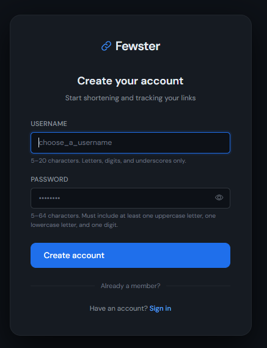
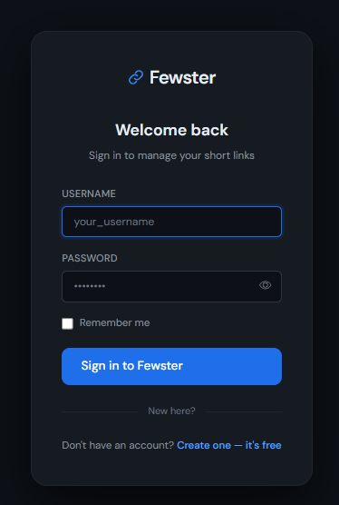
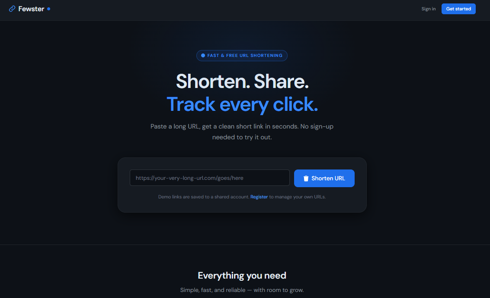
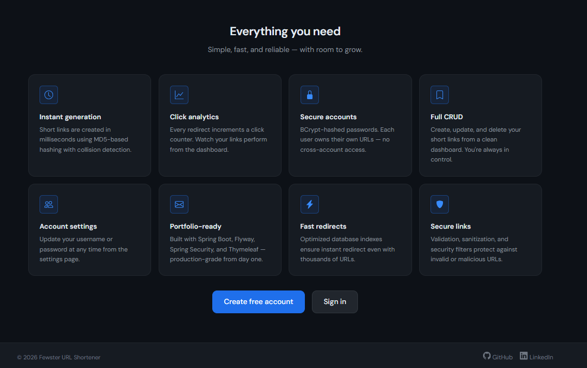
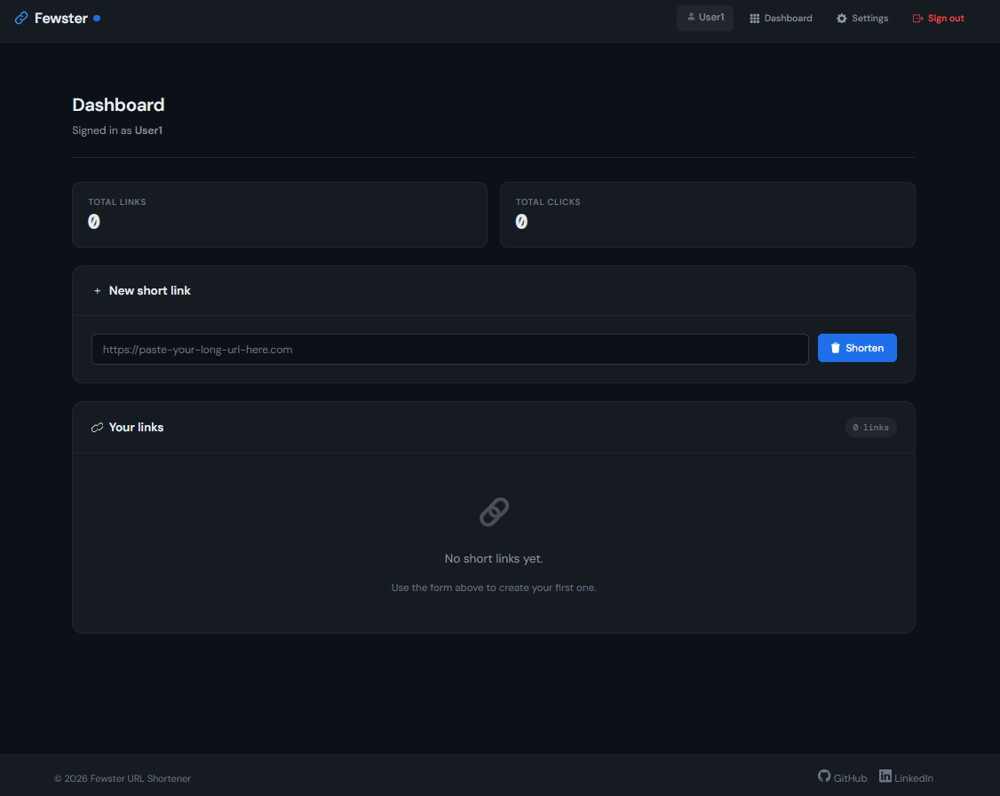
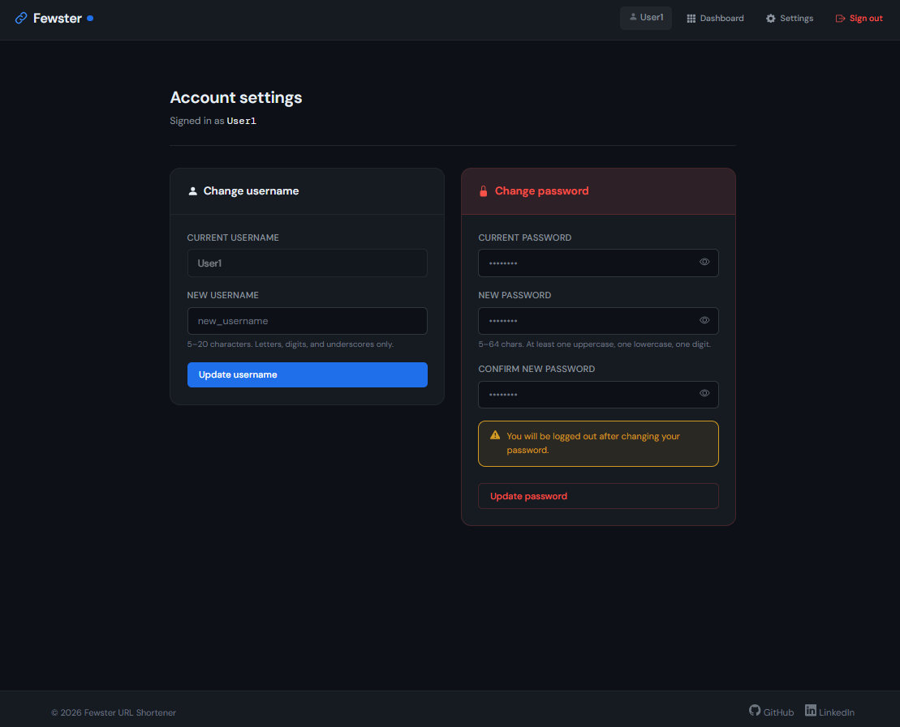

# Fewster — URL Shortener

> A production-grade URL shortening web application built with Spring Boot, Spring Security, Thymeleaf, MySQL, and Flyway. Designed as a portfolio project demonstrating clean architecture, layered exception handling, Docker containerisation, and a professional dark-theme UI.

[](https://hub.docker.com/r/vladbogdadocker/fewster)
[](https://openjdk.org/)
[](https://spring.io/projects/spring-boot)
[](https://www.mysql.com/)

---

## Table of Contents

- [Overview](#overview)
- [Features](#features)
- [Tech Stack](#tech-stack)
- [Architecture](#architecture)
- [Project Structure](#project-structure)
- [Getting Started](#getting-started)
  - [Run with Docker (recommended)](#run-with-docker-recommended)
  - [Run locally (dev profile)](#run-locally-dev-profile)
- [Configuration](#configuration)
- [Database Migrations](#database-migrations)
- [Security](#security)
- [API & Routes](#api--routes)
- [Docker](#docker)
- [Screenshots](#screenshots)
- [Author](#author)

---

## Overview

Fewster lets users shorten long URLs into compact short links, track how many times each link has been clicked, and manage their links from a personal dashboard. Unauthenticated visitors can try the shortener on the home page without registering.

The project is built to portfolio-grade standards: typed exception hierarchy, `@Transactional` service layer, Flyway-managed schema versioning, BCrypt password hashing, Spring Security with per-user resource ownership, and a fully custom dark-navy CSS design system.

---

## Features

- **URL shortening** — MD5-based hash algorithm with collision detection and configurable retry budget
- **Click tracking** — every redirect increments a persistent click counter
- **Demo mode** — visitors can shorten URLs on the home page without an account (linked to a shared demo user)
- **User accounts** — register, login, logout with BCrypt-hashed passwords
- **Per-user CRUD** — create, view, inline-edit, and delete your own short links
- **Account settings** — change username (re-authenticates in-place) or change password (forces re-login)
- **Typed exception layer** — `FewsterException` base class with seven typed subclasses, each carrying its own `HttpStatus`
- **Flyway migrations** — full schema version history from V1 through V8
- **Spring profile switching** — `dev` for local development, `docker` for containerised deployment
- **Dark navy UI** — fully custom CSS design system, DM Sans + DM Mono fonts, no Bootstrap dependency

---

## Tech Stack

| Layer | Technology |
|---|---|
| Language | Java 17 |
| Framework | Spring Boot 3.x |
| Security | Spring Security 6, BCryptPasswordEncoder |
| Persistence | Spring Data JPA, Hibernate |
| Database | MySQL 8.0 |
| Migrations | Flyway |
| Templating | Thymeleaf + Thymeleaf Spring Security extras |
| Build | Maven (multi-stage Docker build) |
| Container | Docker, Docker Compose |
| Fonts | DM Sans, DM Mono (Google Fonts) |

---

## Architecture

```
┌─────────────────────────────────────────────┐
│               Browser / Client              │
└────────────────────┬────────────────────────┘
                     │ HTTP
┌────────────────────▼────────────────────────┐
│           Spring Security Filter            │
│   (session auth, role checks, CSRF off)     │
└────────────────────┬────────────────────────┘
                     │
┌────────────────────▼────────────────────────┐
│              Controllers                    │
│  HomeController   AuthController            │
│  DashboardController  SettingsController    │
│  RedirectController                         │
└────────────────────┬────────────────────────┘
                     │
┌────────────────────▼────────────────────────┐
│               Service Layer                 │
│   UrlService   UserService                  │
│   ShortAlgorithmService   AuthService       │
└────────────────────┬────────────────────────┘
                     │
┌────────────────────▼────────────────────────┐
│            Repository Layer                 │
│      UrlRepository   UserRepository         │
│         (Spring Data JPA)                   │
└────────────────────┬────────────────────────┘
                     │
┌────────────────────▼────────────────────────┐
│              MySQL 8.0                      │
│   tables: url, users  (Flyway managed)      │
└─────────────────────────────────────────────┘
```

**Exception flow:**
All domain exceptions extend `FewsterException` (abstract, carries `HttpStatus`). `GlobalExceptionHandler` has a single `@ExceptionHandler(FewsterException.class)` method — no per-subclass handlers needed. Adding a new exception type in future requires only creating the class.

---

## Project Structure

```
fewster-app/
├── src/
│   └── main/
│       ├── java/com/vladproduction/fewster/
│       │   ├── controller/
│       │   │   ├── AuthController.java
│       │   │   ├── DashboardController.java
│       │   │   ├── HomeController.java
│       │   │   ├── RedirectController.java
│       │   │   └── SettingsController.java
│       │   ├── dto/
│       │   │   ├── UrlDTO.java
│       │   │   ├── UserDTO.java
│       │   │   ├── ChangeUsernameDTO.java
│       │   │   └── ChangePasswordDTO.java
│       │   ├── entity/
│       │   │   ├── UrlEntity.java
│       │   │   └── User.java
│       │   ├── exception/
│       │   │   ├── FewsterException.java          ← base class
│       │   │   ├── UrlNotFoundException.java
│       │   │   ├── UserNotFoundException.java
│       │   │   ├── UserAlreadyExistsException.java
│       │   │   ├── DuplicateUrlException.java
│       │   │   ├── InvalidUrlException.java
│       │   │   ├── FewsterAccessDeniedException.java
│       │   │   ├── ShortUrlGenerationException.java
│       │   │   └── GlobalExceptionHandler.java
│       │   ├── mapper/
│       │   │   └── UrlMapper.java
│       │   ├── repository/
│       │   │   ├── UrlRepository.java
│       │   │   └── UserRepository.java
│       │   ├── security/
│       │   │   ├── AuthService.java
│       │   │   ├── CustomUserDetailsService.java
│       │   │   └── SecurityConfig.java
│       │   ├── service/
│       │   │   ├── ShortAlgorithmService.java
│       │   │   ├── UrlService.java
│       │   │   ├── UserService.java
│       │   │   └── impl/
│       │   │       ├── ShortAlgorithmServiceImpl.java
│       │   │       ├── UrlServiceImpl.java
│       │   │       └── UserServiceImpl.java
│       │   └── utility/
│       │       ├── AlgorithmUtility.java
│       │       └── GlobalUtility.java
│       └── resources/
│           ├── application.yml                    ← profile switcher
│           ├── application-dev.yml                ← local dev config
│           ├── application-docker.yml             ← Docker config
│           ├── db/migration/
│           │   ├── V1__createURLTable.sql
│           │   ├── V2__createUserTable.sql
│           │   ├── V3__alterUserTable.sql
│           │   ├── V4__add_user_relationship_to_url_table.sql
│           │   ├── V5__clean_slate_make_user_id_required.sql
│           │   ├── V6__create_demo_user.sql
│           │   ├── V7__fix_demo_user_password.sql
│           │   └── V8__add_settings_index_on_username.sql
│           ├── static/css/
│           │   └── fewster.css
│           └── templates/
│               ├── fragments/
│               │   ├── header-frag.html
│               │   └── footer-frag.html
│               ├── auth/
│               │   ├── login.html
│               │   └── register.html
│               ├── dashboard/
│               │   └── profile.html
│               ├── settings/
│               │   └── settings.html
│               └── index.html
├── .env                                           ← secrets (not committed)
├── .env.example                                   ← template for teammates
├── .gitignore
├── docker-compose.yml
├── Dockerfile
└── pom.xml
```

---

## Getting Started

### Run with Docker (recommended)

**Prerequisites:** Docker Desktop installed and running.

**1. Clone the repository**
```bash
git clone https://github.com/vbforge/fewster-app.git
cd fewster-app
```

**2. Create your `.env` file**
```bash
cp .env.example .env
```
Open `.env` and set your passwords:
```env
DB_USERNAME=fewster_user
DB_PASSWORD=your_secure_password
DB_ROOT_PASSWORD=your_root_password
```

**3. Start the application**
```bash
docker compose up -d
```

Docker will pull the image from Docker Hub, start MySQL, wait for it to be healthy, then start the app.

**4. Open in browser**
```
http://localhost:8081
```

**5. Stop the application**
```bash
docker compose down          # stops containers, data is preserved
docker compose down -v       # stops containers AND deletes all data
```

---

### Run locally (dev profile)

**Prerequisites:** Java 17, Maven, MySQL 8.0 running locally.

**1. Create the database**
```sql
CREATE DATABASE fewsterdb;
```

**2. Configure datasource**

In `application-dev.yml`, uncomment the local datasource block and set your credentials:
```yaml
url: jdbc:mysql://localhost:3306/fewsterdb?createDatabaseIfNotExist=true&useSSL=false&allowPublicKeyRetrieval=true
username: root
password: your_password
```

**3. Run**
```bash
mvn spring-boot:run
```

App starts at `http://localhost:8081`.

---

## Configuration

| Property | Dev default | Docker default | Description |
|---|---|---|---|
| `server.port` | `8081` | `8080` (internal) | HTTP port |
| `base.url.prefix` | `http://localhost:8081/r/` | `http://localhost:8081/r/` | Prepended to every short code |
| `short.url.length` | `6` | `6` | Short code character length |
| `generate.unique.short.url.maxAttempt` | `5` | `5` | Collision retry budget |
| `role.name` | `USER` | `USER` | Default role assigned on registration |

**Environment variables (Docker only):**

| Variable | Description |
|---|---|
| `SPRING_PROFILE` | Set to `docker` by docker-compose |
| `DB_URL` | Full JDBC connection string |
| `DB_USERNAME` | Database username |
| `DB_PASSWORD` | Database password |
| `BASE_URL_PREFIX` | Override the short URL prefix (e.g. for a real domain) |

---

## Database Migrations

Schema is managed exclusively by Flyway. Hibernate is set to `validate` in all profiles — it never modifies the schema.

| Version | Description |
|---|---|
| V1 | Create `url` table |
| V2 | Create `users` table |
| V3 | Widen column types in `users` |
| V4 | Add `user_id` FK to `url`, indexes |
| V5 | Make `user_id` NOT NULL, remove orphaned rows |
| V6 | Insert `demouser` account |
| V7 | Fix demo user password (BCrypt hash) |
| V8 | Add index on `users.username` |

---

## Security

- Passwords are hashed with **BCryptPasswordEncoder** (strength 10)
- Each user can only access and modify their **own** URLs — ownership is checked on every read, update, and delete operation
- The `demouser` account is used for unauthenticated demo shortenings on the home page — it cannot log in interactively
- Session is invalidated on logout (`JSESSIONID` cookie deleted)
- Password change forces an immediate logout and re-authentication
- Username change re-authenticates the Spring Security context in-place (no logout required)
- CSRF is disabled (stateful session app without CSRF tokens in forms — re-enable for production hardening)

**Protected routes:**

| Route pattern | Requirement |
|---|---|
| `/dashboard/**` | Authenticated + `ROLE_USER` |
| `/settings/**` | Authenticated + `ROLE_USER` |
| `/api/v1/url/**` | Authenticated + `ROLE_USER` |
| `/r/**` | Public |
| `/`, `/login`, `/register`, `/demo-create` | Public |

---

## API & Routes

| Method | Path | Auth | Description |
|---|---|---|---|
| `GET` | `/` | Public | Home page with demo shortener |
| `POST` | `/demo-create` | Public | Shorten a URL as demo user |
| `GET` | `/r/{shortCode}` | Public | Redirect to original URL |
| `GET` | `/login` | Public | Login page |
| `POST` | `/login` | Public | Spring Security login processing |
| `GET` | `/register` | Public | Registration page |
| `POST` | `/register` | Public | Create new account |
| `GET` | `/dashboard` | Auth | Dashboard with URL list |
| `POST` | `/dashboard/create` | Auth | Create new short link |
| `POST` | `/dashboard/update/{id}` | Auth | Update original URL |
| `POST` | `/dashboard/delete/{id}` | Auth | Delete short link |
| `GET` | `/settings` | Auth | Account settings page |
| `POST` | `/settings/username` | Auth | Change username |
| `POST` | `/settings/password` | Auth | Change password |
| `POST` | `/logout` | Auth | Invalidate session |

---

## Docker

**Image:** [`vladbogdadocker/fewster`](https://hub.docker.com/r/vladbogdadocker/fewster)

The Dockerfile uses a **two-stage build**:
- Stage 1 (`maven:3.9.6-eclipse-temurin-17`) — compiles the project with `mvn clean package -DskipTests`
- Stage 2 (`eclipse-temurin:17-jre-alpine`) — copies only the final JAR into a minimal Alpine JRE image

**Data persistence:**

MySQL data is stored in a Docker named volume (`mysql_data`). The volume survives `docker compose down` and is only removed with `docker compose down -v`.

**Rebuild and redeploy workflow:**
```bash
docker build -t vladbogdadocker/fewster:latest .
docker push vladbogdadocker/fewster:latest
docker compose down
docker compose up -d
```

---

## Screenshots

1) 
2) 
3) 
4) 
5) 
6) 

---

## Author

**Vlad Bogdantsev**
- GitHub: [@vbforge](https://github.com/vbforge)
- LinkedIn: [vlad-bogdantsev](https://www.linkedin.com/in/vlad-bogdantsev-7897662b2/)
- Docker Hub: [vladbogdadocker](https://hub.docker.com/u/vladbogdadocker)
